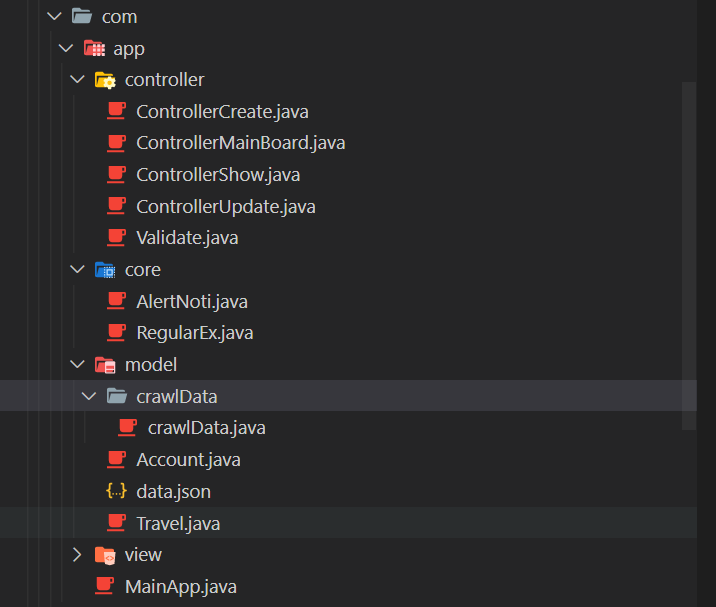
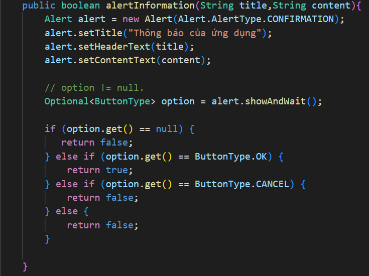

# Managerment Travel Tour

* To help everyone can know travel tour
* Admin can CRUD

## Technology

* Mock API to store Data (crawl from website: <https://dulichviet.com.vn/>)

## Folder constructor

## Entity Relationship Model

* I use API with a data without relationship

## Video demo

* Youtube link: <https://www.youtube.com/watch?v=dib_qAasjno>

### Function I done

1. Create a new tour
2. Show all tours
3. Remove a tour
4. Update a tour

### Function I am doing

1. Login with admin or user

2. validate data

### Function I will do

1. Find tour

## Sharing about the project

* I create a function alert and I will use it when I need to confirm when use do something like: delete, update,create,login,logout

## To use

* Please install in maven <!-- https://mvnrepository.com/artifact/org.json/json -->

        <dependency>
            <groupId>org.json</groupId>
            <artifactId>json</artifactId>
            <version>20210307</version>
        </dependency>

## How to run?

* Please move to  src/main/java/com/app/MainApp.java  to run applycattion

## Commit history

* <https://github.com/tranvanhieu01012002/ManagementTraveling/commits/main>
